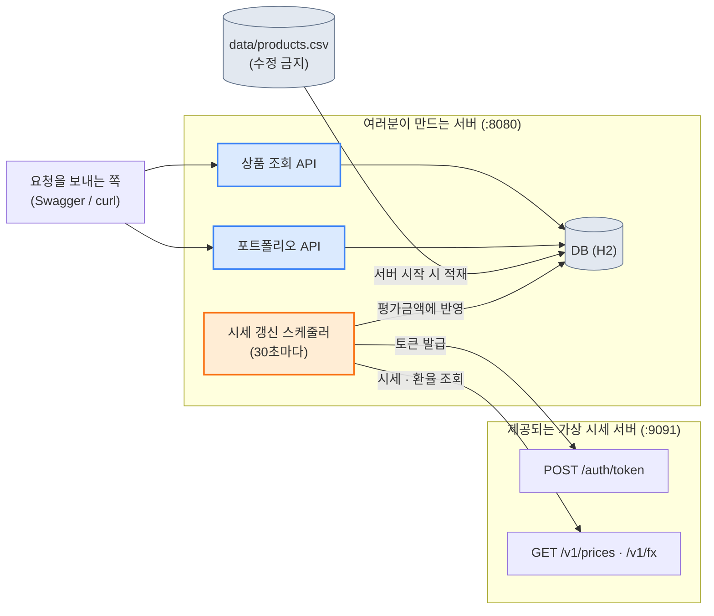

# 가상 포트폴리오 수익률 서비스

> 백엔드 실습 과제 · 상태: **문서 확정 v1.2** (2026-09-28) · 가상 시세 서버·정답 서버로 모든 시나리오 실제 검증 완료

> [!IMPORTANT]
> 이 문서를 **처음부터 끝까지 꼼꼼히** 읽고 시작하세요. **정해진 약속은 그대로 지키고, 정해지지 않은 부분은 스스로 발견해서 결정**합니다.

> [!TIP]
> 📄 **처음이라 막막하다면 [`docs/requirements-overview.pdf`](docs/requirements-overview.pdf)부터 열어보세요.** 그림 위주로 큰 그림과 핵심 함정을 3페이지로 정리한 요약본입니다. 자세한 규격은 이 README가 기준입니다.

## 한눈에 보기

| | |
|---|---|
| 🎯 **보는 능력** | 자율 구현과 명세 해석 — 뼈대 없이 스스로 설계하고, 빈틈을 발견해 합리적으로 결정하는가 |
| 🧩 **만드는 것** | 포트폴리오 서버 1개 (Java 17 · Spring Boot 4.1.1 · Gradle · JPA + H2) |
| 📦 **제공되는 것** | 가상 시세 서버(Docker), 상품 데이터 파일, 이 가이드, 문서 템플릿 |
| ⏱️ **제한 시간** | 없음 |
| ⚠️ **핵심 난제** | 상품 데이터는 지저분하고(중복·표기 혼재), 시세 서버는 토큰이 만료되고 가끔 불안정합니다 |

## 목차

- [이 폴더에는 무엇이 있나](#이-폴더에는-무엇이-있나)
- [1. 과제 소개](#1-과제-소개)
- [2. 여러분이 만드는 것과 제공되는 것](#2-여러분이-만드는-것과-제공되는-것)
- [3. 시작하기](#3-시작하기)
- [4. 알아야 할 용어](#4-알아야-할-용어)
- [5. 약속 1 — 여러분의 서버 API](#5-약속-1--여러분의-서버-api)
- [6. 약속 2 — 계산 규칙](#6-약속-2--계산-규칙)
- [7. 약속 3 — 가상 시세 서버](#7-약속-3--가상-시세-서버)
- [8. 명세 밖의 결정과 가정 문서](#8-명세-밖의-결정과-가정-문서)
- [9. 요구사항 요약](#9-요구사항-요약)
- [10. 시나리오 체크리스트](#10-시나리오-체크리스트)
- [11. 제출](#11-제출)
- [12. 평가 안내](#12-평가-안내)
- [13. 막혔을 때 (힌트)](#13-막혔을-때-힌트)

---

## 이 폴더에는 무엇이 있나

| 파일·폴더 | 용도 |
|---|---|
| `README.md` (이 문서) | 과제 설명, 약속, 요구사항, 시나리오, 힌트 — 전부 여기 있습니다 |
| [`docs/requirements-overview.pdf`](docs/requirements-overview.pdf) | **처음 보시는 분들을 위한 요약본** (3페이지, 그림 위주) |
| `starter-project/` | **여기서 시작하세요.** 빌드 설정과 실행 진입점만 있는 빈 프로젝트입니다 (도메인 코드 없음) |
| `compose.yaml` | 가상 시세 서버를 실행하는 설정 |
| `data/products.csv` | 상품 데이터 (수정 금지) — `starter-project/data/products.csv`로 복사해서 쓰세요 |
| `docs-template/assumptions.md`, `docs-template/api.md` | 문서 템플릿. 복사해서 `starter-project/docs/`에 채우세요 |
| `requests.http` | IntelliJ HTTP Client용 요청 예시 (시나리오 확인용) |

## 1. 과제 소개

투자 앱을 만든다고 생각해 보세요. 사용자는 **투자 상품 목록**을 살펴보고, 마음에 드는 상품을 골라 **나만의 포트폴리오**를 만듭니다. 그리고 상품 가격이 바뀔 때마다 **내 포트폴리오가 얼마나 벌었는지(수익률)** 확인하고 싶어 합니다.

여러분은 이 서비스의 서버를 **처음부터** 만듭니다. 상품 데이터 파일과 **시세를 알려 주는 외부 서버**가 제공됩니다.

> [!TIP]
> **이 과제에서 보는 능력: 자율 구현과 명세 해석.**
> - 명세를 **끝까지 정확히 읽고** 적힌 대로 구현하기
> - 명세에 **적혀 있지 않은 부분**을 스스로 발견하고, 합리적으로 **결정하고 그 이유를 기록**하기
> - 뼈대 없이 **스스로 설계**하기 (모델링, 외부 연동, 주기 작업)
> - 주어진 데이터를 **그대로 믿지 않기**

> [!IMPORTANT]
> 이 문서에는 **일부러 정해 두지 않은 부분**이 있습니다. 그런 부분을 찾아서 여러분이 결정하고 `docs/assumptions.md`에 기록하는 것도 과제의 일부입니다.

## 2. 여러분이 만드는 것과 제공되는 것

| | 내용 |
|---|---|
| **여러분이 만드는 것** | 서버 1개 (상품 조회, 포트폴리오 관리, 시세 갱신, 수익률 계산). **처음부터** 만듭니다 |
| **제공되는 것** | 가상 시세 서버(Docker), 상품 데이터 파일, 이 가이드, 문서 템플릿, 요청 예시 |
| 스택 | Java 17, Spring Boot 4.1.1, Gradle, JPA + H2 |
| 제한 시간 | 없음 |



## 3. 시작하기

1. 가상 시세 서버를 실행합니다. `compose.yaml`이 이미지를 자동으로 받아옵니다 — 파일을 따로 내려받거나 `docker load`를 할 필요가 없습니다.
   ```bash
   docker compose up
   ```
2. `http://localhost:9091/swagger-ui.html`에서 시세 서버의 API를 확인합니다.
3. 상품 데이터는 `data/products.csv`입니다. `starter-project/data/products.csv`로 복사하세요. **이 파일은 수정하지 않습니다.**
4. 여러분의 서버는 `8080` 포트로 실행합니다. (`./gradlew bootRun`)
5. 시세 서버 주소는 환경변수 `PRICE_BASE_URL`로 바꿀 수 있게 하고, 기본값은 `http://localhost:9091`로 합니다.

## 4. 알아야 할 용어

| 용어 | 뜻 |
|---|---|
| **포트폴리오** | 사용자가 고른 투자 상품과 수량의 묶음 |
| **매입가** | 그 상품을 포트폴리오에 **담은 시점의 가격** |
| **매입금액(원가)** | 매입가 × 수량의 합 |
| **평가금액** | **지금 가격** × 수량의 합 |
| **수익률** | (평가금액 − 매입금액) ÷ 매입금액 × 100 |
| **토큰 (액세스 토큰)** | 외부 서버가 "이 사람은 써도 된다"고 알려 주는 임시 열쇠. **일정 시간이 지나면 만료**됨 |
| **스케줄링** | 정해진 주기로 작업을 자동 실행하는 것 |
| **가정** | 명세에 없는 부분을 내가 정한 결정. 반드시 **이유와 함께 기록**해야 함 |

---

## 5. 약속 1 — 여러분의 서버 API

**고정된 경로와 필드는 그대로** 지켜야 하고, 그 밖의 필드나 API는 **자유롭게 추가**해도 됩니다. 추가한 것은 `docs/api.md`에 적습니다.

### 5-1. 상품 조회

`GET /api/v1/products?query=&type=&currency=&riskLevel=&sort=&page=&size=`

| 파라미터 | 규칙 |
|---|---|
| `query` | 코드, 이름, 영문명에서 **부분 일치**. 영문은 대소문자를 구분하지 않습니다 |
| `type` | `ETF`, `FUND`, `BOND` |
| `currency` | `KRW`, `USD` |
| `riskLevel` | 1~5 |
| `sort` | `필드,방향` (필드: `code`, `name`, `listedDate`, `riskLevel` / 방향: `asc`, `desc`). 기본 `code,asc` |
| `page`, `size` | `page`는 0 이상, `size`는 1~100 (기본 20) |
| 결합 | 서로 다른 필터는 **AND**로 동작합니다 |

**응답**

```json
{
  "items": [ { "code": "A001", "name": "...", "nameEn": "...", "type": "ETF", "currency": "KRW",
               "riskLevel": 3, "issuer": "...", "listedDate": "2020-01-05", "currentPrice": 1200 } ],
  "page": 0, "size": 20, "totalElements": 1, "totalPages": 1
}
```

- `currency`는 `KRW` 또는 `USD`, `listedDate`는 `yyyy-MM-dd` 형식으로 응답합니다.
- `riskLevel`이 없으면 `null`, `currentPrice`는 최신 시세(아직 없으면 `null`)입니다.

### 5-2. 포트폴리오

| API | 내용 |
|---|---|
| `POST /api/v1/portfolios` | 생성 → **201**, 상세와 같은 형식으로 응답 |
| `GET /api/v1/portfolios/{id}` | 상세 (평가 결과 포함) |
| `GET /api/v1/portfolios?query=&sort=&page=&size=` | 목록. `query`는 이름 부분 일치(대소문자 무시). `sort`: `name`, `createdAt`, `returnRate`, `totalValue` (기본 `createdAt,desc`) |
| `PUT /api/v1/portfolios/{id}` | 이름과 보유 종목을 **전체 교체** → 200 |
| `DELETE /api/v1/portfolios/{id}` | 삭제 → **204** |

**생성·수정 요청**

```json
{ "name": "내 포트폴리오", "holdings": [ { "code": "A001", "quantity": 10 }, { "code": "A002", "quantity": 5 } ] }
```

**상세 응답** (아래 필드는 **반드시** 포함, 이 밖에 자유롭게 추가 가능)

```json
{
  "id": 1, "name": "내 포트폴리오", "createdAt": "2026-09-21T10:00:00",
  "holdings": [ { "code": "A001", "quantity": 10, "purchasePrice": 1000, "currentPrice": 1200 } ],
  "summary": { "totalCost": 10000, "totalValue": 12000, "profit": 2000, "returnRate": 20.00,
               "todayProfit": 500, "asOf": "2026-09-21T10:00:30" }
}
```

| 필드 | 뜻 |
|---|---|
| `totalCost` | 매입금액 (원) |
| `totalValue` | 평가금액 (원) |
| `profit` | 수익금 (원) |
| `returnRate` | 수익률 (%) |
| `todayProfit` | **오늘 손익** (원) |
| `asOf` | 이 계산에 쓴 시세의 기준 시각 |

- `id`는 숫자든 문자열이든 괜찮습니다.
- **목록**의 각 항목은 `id`, `name`, `totalValue`, `returnRate`, `createdAt`을 포함합니다.

**입력 규칙**

| 필드 | 규칙 |
|---|---|
| `name` | 1~50자 |
| `holdings` | 1~20개. 같은 `code`를 두 번 쓸 수 없음 |
| `quantity` | 1 이상 1,000,000 이하 정수 |
| `code` | 존재하는 상품이어야 함 |

| 상황 | 상태 코드 | 본문 |
|---|---|---|
| 입력 오류 | **400** | `{"code":"INVALID_REQUEST","message":"..."}` |
| 존재하지 않는 상품 코드 | **400** | `{"code":"UNKNOWN_PRODUCT","message":"..."}` |
| 없는 포트폴리오 | **404** | `{"code":"PORTFOLIO_NOT_FOUND","message":"..."}` |
| 시세가 아직 없음 (생성·수정) | **503** | `{"code":"PRICE_NOT_READY","message":"..."}` |

---

## 6. 약속 2 — 계산 규칙

| 규칙 | 내용 |
|---|---|
| 매입가 | 포트폴리오에 종목을 담는 시점에 **가장 최근에 받아 둔 시세**로 정해지고, 이후 **시세가 바뀌어도 바뀌지 않습니다** |
| 매입금액 | 종목별 `수량 × 매입가`의 합 |
| 평가금액 | 종목별 `수량 × 현재가`의 합 |
| 수익금 | 평가금액 − 매입금액 |
| 수익률 | 수익금 ÷ 매입금액 × 100 (%) |
| 시세 갱신 | **30초마다** 시세 서버에서 시세를 가져옵니다 |
| 시세가 아직 없을 때 | 포트폴리오 생성·수정은 503 |
| 시세 서버 장애 | **시세를 못 가져와도 포트폴리오 조회 API는 응답해야 합니다** (무엇을 보여줄지는 여러분이 정합니다) |

> [!IMPORTANT]
> **반올림 규칙**: **금액(원)은 원 단위 미만을 버립니다(절사). 수익률은 소수 둘째 자리까지 반올림(HALF_UP)** 합니다. 이 둘을 섞어 쓰지 않도록 주의하세요.

---

## 7. 약속 3 — 가상 시세 서버

주소: `http://localhost:9091` · 자세한 명세는 Swagger에서 확인하세요.

### 토큰 발급

`POST /auth/token`

```json
{ "clientId": "student", "clientSecret": "student-secret" }
```

응답 (200)

```json
{ "accessToken": "eyJ...", "tokenType": "Bearer", "expiresIn": 120 }
```

`expiresIn`은 **초 단위**이며, 그 시간이 지나면 토큰은 **쓸 수 없게 됩니다.** 인증 정보가 틀리면 401입니다.

### 시세 조회

`GET /v1/prices` (헤더 `Authorization: Bearer <토큰>`)

```json
{ "asOf": "2026-09-21T10:00:30", "prices": [ { "code": "A001", "price": 1200, "currency": "KRW" } ] }
```

### 환율 조회

`GET /v1/fx?pair=USD-KRW` (헤더 `Authorization: Bearer <토큰>`)

```json
{ "pair": "USD-KRW", "rate": 1350.25, "asOf": "2026-09-21T10:00:30" }
```

### 알아 둘 점

- 시세와 환율은 **30초마다** 바뀝니다.
- 원화 상품의 가격은 정수, 달러 상품의 가격과 환율은 소수 둘째 자리입니다.
- 토큰이 없거나 만료되면 **401** (`TOKEN_EXPIRED` 또는 `UNAUTHORIZED`), 서버가 일시적으로 불안정하면 **503**이 올 수 있습니다.

---

## 8. 명세 밖의 결정과 가정 문서

이 과제에는 명세에 **일부러 정하지 않은 부분**이 있습니다. 실제 업무에서도 요구사항은 완벽하지 않고, 빈틈을 발견해서 **질문하거나 합리적으로 결정**하는 것이 중요합니다.

- 요구사항을 읽으며 "이 경우는 어떻게 해야 하지?" 싶은 부분을 **최소 3개 이상** 찾아보세요.
- 각각에 대해 여러분이 **어떻게 결정**했고 **왜 그렇게 했는지**를 `docs/assumptions.md`에 기록합니다.
- **결정은 코드에 실제로 반영**되어야 합니다. 문서와 동작이 다르면 감점입니다.
- 정답은 하나가 아닙니다. **이유가 타당한지**가 중요합니다.

**가정 문서 템플릿** (`docs/assumptions.md`)

```markdown
# 가정 문서

| # | 상황 (명세에 없는 부분) | 나의 결정 | 이유 | 고려한 다른 선택지 | 코드 위치 | 실무라면 확인할 질문 |
|---|---|---|---|---|---|---|
| 1 | | | | | | |
| 2 | | | | | | |
| 3 | | | | | | |
```

---

## 9. 요구사항 요약

| # | 요구 |
|---|---|
| R1 | 서버 시작 시 `data/products.csv`를 읽어 상품을 저장한다. 파일은 수정하지 않는다 |
| R2 | 상품 조회 API (검색, 정렬, 필터, 페이지) |
| R3 | 포트폴리오 생성, 조회, 목록, 수정, 삭제 API |
| R4 | 시세 서버에서 **30초마다** 시세와 환율을 가져와 평가금액에 반영한다 |
| R5 | 시세 서버의 토큰이 만료되어도 서비스가 이어진다 |
| R6 | 시세 서버가 불안정해도 포트폴리오 조회 API는 응답한다 |
| R7 | 명세에 없는 부분을 발견해 결정하고 `docs/assumptions.md`에 기록한다 |
| R8 | 추가한 API와 필드를 `docs/api.md`에 기록한다 |

## 10. 시나리오 체크리스트

| # | 시나리오 | 기대 결과 |
|---|---|---|
| S1 | 상품 검색 | 코드·이름·영문명 부분 일치, 영문 대소문자 무시 |
| S2 | 상품 정렬 | 이름·상장일·위험등급 정렬이 정확함 |
| S3 | 상품 필터 | 유형·통화·위험등급 필터가 정확하고 여러 필터는 AND |
| S4 | 상품 데이터 정리 | 상품이 중복 없이 하나씩 조회되고, 통화는 `KRW`/`USD`, 상장일은 `yyyy-MM-dd`로 응답 |
| S5 | 포트폴리오 생성·조회·삭제, 입력 검증 | 201/200/204, 잘못된 입력 400, 없는 ID 404 |
| S6 | 포트폴리오 목록 | 이름 검색, 정렬, 페이지 |
| S7 | 매입 시점 고정 | 시세가 바뀌어도 매입가·매입금액은 그대로, 평가금액만 변함 |
| S8 | 평가 계산 | 평가금액, 수익금, 수익률이 계산 규칙(반올림 포함)대로 정확함 |
| S9 | 시세 주기 갱신 | 시세가 바뀌면 **45초 안에** 평가금액에 반영됨 |
| S10 | 토큰 만료 | 토큰이 만료돼도 갱신이 이어지고, **토큰을 매번 새로 받지 않음** |
| S11 | 시세 서버 장애 | 시세 서버가 응답하지 않아도 포트폴리오 조회 API가 응답함 |

## 11. 제출

`docs/assumptions.md`와 `docs/api.md`를 포함해 아래 구조로 제출합니다.

```
<제출 프로젝트>/
├── build.gradle 등, src/
├── data/products.csv         # 제공된 파일 그대로 (수정 금지)
├── README.md                 # 실행 방법
└── docs/
    ├── api.md                # 내가 만든 API 문서 (추가한 API와 필드 포함)
    └── assumptions.md        # 가정 문서 (템플릿의 표 형식)
```

| 항목 | 규칙 |
|---|---|
| 실행 | 루트에서 `./gradlew bootRun`, 포트 **8080** |
| 시세 서버 주소 | 환경변수 `PRICE_BASE_URL` (기본 `http://localhost:9091`) |
| 데이터 | `data/products.csv`를 **수정하지 않고** 읽습니다 |
| DB | H2, 별도 설치 없이 실행 가능해야 함 |
| README | 실행 방법과 확인한 시나리오 |

## 12. 평가 안내

| 영역 | 배점 | 내용 |
|---|---|---|
| A. 명세 정확성 | 35 | 시나리오 S1~S11 통과 |
| B. 명세 해석과 가정 | 30 | 빈틈을 찾고, 합리적으로 결정하고, 이유를 쓰고, 코드에 반영했는가 |
| C. 설계·구현 | 20 | 모델링, 외부 연동, 갱신 구조, 데이터 정리 |
| D. 지시 준수·문서 | 15 | 제출 규칙, README·API 문서, 코드 품질, 테스트 |

> [!WARNING]
> **이렇게 하면 크게 감점됩니다**
> - `data/products.csv`를 수정함
> - 시세 서버가 불안정할 때 조회 API가 오류(5xx)를 냄
> - 서버가 실행되지 않음

## 13. 막혔을 때 (힌트)

막혔을 때 **하나씩만** 열어 보세요.

<details>
<summary><b>힌트 1: 데이터</b></summary>
<br>

파일을 열어서 **직접 눈으로** 확인하세요. 같은 상품이 두 번 나오지는 않나요? 값의 표기는 모두 같은가요? 날짜는 모두 같은 형식인가요? 비어 있는 칸은 없나요?

</details>

<details>
<summary><b>힌트 2: 토큰</b></summary>
<br>

토큰마다 **유효 시간**이 있습니다. 시세를 가져올 때마다 새 토큰을 받는 것과, 받은 토큰을 **재사용하다가 만료되면 다시 받는 것**은 어떻게 다를까요? 401을 받았을 때 어떻게 해야 할까요?

</details>

<details>
<summary><b>힌트 2-1: 시세 서버가 불안정할 때</b></summary>
<br>

외부 서버의 문제가 **내 서버의 응답을 망가뜨리면** 안 됩니다. 마지막으로 성공한 시세를 어떻게 보관하고 활용할 수 있을까요?

</details>

<details>
<summary><b>힌트 3: 명세 밖의 빈틈을 찾는 질문들</b></summary>
<br>

- 포트폴리오의 **구성을 바꾸면**(종목을 늘리거나 줄이면) 매입가와 수익률은 어떻게 되어야 할까요?
- "**오늘**"의 손익이란 정확히 언제부터 언제까지일까요?
- **원화가 아닌 상품**이 섞여 있으면 어떤 환율로 계산해야 할까요?
- **시세를 못 가져오면** 사용자에게 무엇을 보여줘야 할까요?
- 데이터에 **이상한 값**이 있으면 어떻게 처리할까요?

</details>

<details>
<summary><b>힌트 4: 계산</b></summary>
<br>

금액은 **버림**, 수익률은 **반올림**이라는 규칙을 한 번에 지키려면 계산을 어떤 순서로 해야 할까요? 소수 오차를 피하려면 어떤 타입을 써야 할까요?

</details>
