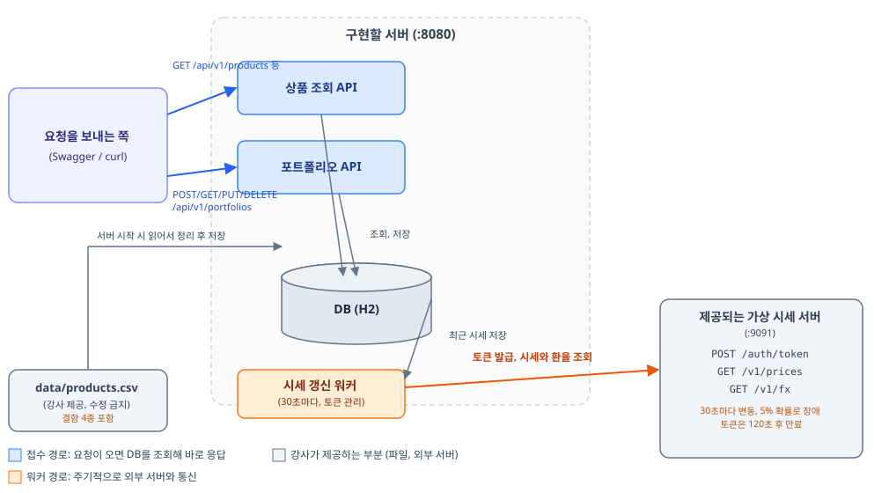

# 가상 포트폴리오 수익률 서비스

> 백엔드 사전 과제 (문서 버전 v1.4, 2026-10-20)

> [!IMPORTANT]
> **과제 시작 전 확인 사항**
> - 이 문서에 적힌 요구사항은 반드시 그대로 지켜야 합니다.
> - 명세에 정해지지 않은 부분은 직접 찾아서 결정하고, 그 내용을 문서로 남겨 주세요(8장).

> [!TIP]
> - 처음이라면 3페이지 요약 자료 [`docs/requirements-overview.pdf`](docs/requirements-overview.pdf)로 전체 흐름을 먼저 본 뒤, 이 문서를 처음부터 끝까지 읽어 주세요.
> - 세부 요구사항은 이 문서를 기준으로 합니다.

## 과제 개요

- 빌드 설정만 있는 빈 시작 프로젝트에서 출발해, 포트폴리오 서버 1개의 도메인 코드를 모두 직접 설계하고 구현합니다.
- 명세의 빈틈을 찾아 합리적으로 결정할 수 있는지를 봅니다.
- 가상 시세 서버(Docker 이미지), 상품 데이터 파일, 문서 템플릿을 제공합니다.
- 상품 데이터에는 같은 상품 코드가 두 번 나오는 행과 서로 다른 표기가 섞여 있습니다. 시세 서버가 발급한 토큰은 일정 시간 뒤 만료되고, 시세 서버는 가끔 장애를 일으킵니다.
- 기술 스택은 Java 17, Spring Boot 4.1.1, Gradle, JPA, H2입니다. 제한 시간은 없습니다.

## 목차

- [과제 저장소 구성](#과제-저장소-구성)
- [1. 과제 소개](#1-과제-소개)
- [2. 구현 범위와 제공 자료](#2-구현-범위와-제공-자료)
- [3. 시작하기](#3-시작하기)
- [4. 용어 설명](#4-용어-설명)
- [5. 구현할 API 명세](#5-구현할-api-명세)
- [6. 계산 규칙](#6-계산-규칙)
- [7. 가상 시세 서버 API 명세](#7-가상-시세-서버-api-명세)
- [8. 명세에 없는 부분과 가정 문서](#8-명세에-없는-부분과-가정-문서)
- [9. 요구사항 요약](#9-요구사항-요약)
- [10. 시나리오 체크리스트](#10-시나리오-체크리스트)
- [11. 제출 방법](#11-제출-방법)
- [12. 평가 안내](#12-평가-안내)
- [13. 힌트](#13-힌트)

---

## 과제 저장소 구성

| 파일 및 폴더 | 용도 |
|---|---|
| `README.md` | 이 문서. 과제 설명, API 명세, 요구사항, 시나리오, 힌트 |
| [`docs/requirements-overview.pdf`](docs/requirements-overview.pdf) | 3페이지 분량의 과제 요약 자료 |
| `starter-project/` | 과제를 시작할 프로젝트. 빌드 설정과 실행 클래스만 있고 도메인 코드는 없습니다. **이 폴더가 제출 저장소의 최상위가 됩니다.** |
| `compose.yaml` | 가상 시세 서버 실행 설정 |
| `data/products.csv` | 상품 데이터 (수정 금지). `starter-project/data/products.csv`로 복사해서 사용해 주세요. |
| `docs-template/assumptions.md`, `docs-template/api.md` | 문서 템플릿. `starter-project/docs/`로 복사해서 작성해 주세요. |
| `requests.http` | 시나리오 확인용 요청 예시 (IntelliJ HTTP Client 형식) |

## 1. 과제 소개

투자 앱의 서버를 만드는 과제입니다.

- 사용자는 투자 상품 목록을 보고, 원하는 상품을 골라 포트폴리오를 만듭니다.
- 상품 가격이 바뀌면 포트폴리오의 수익률을 확인할 수 있어야 합니다.

상품 데이터 파일과, 시세를 알려 주는 가상 시세 서버를 제공합니다.

> [!TIP]
> 이 과제에서는 네 가지를 확인합니다.
> - 명세를 끝까지 읽고 적힌 대로 구현했는가
> - 명세에 적혀 있지 않은 부분을 찾아 결정하고, 그 이유를 기록했는가
> - 데이터 모델, 외부 연동, 주기 작업을 직접 설계했는가
> - 주어진 데이터를 검증하고 정리해서 썼는가

> [!IMPORTANT]
> - 이 문서에는 일부러 정해 두지 않은 부분이 있습니다.
> - 그런 부분을 찾아서 결정하고 가정 문서(`starter-project/docs/assumptions.md`)에 기록하는 것도 과제에 포함됩니다.

## 2. 구현 범위와 제공 자료

- 서버 1개를 구현합니다. 상품 조회, 포트폴리오 관리, 시세 갱신, 수익률 계산 기능이 필요합니다.
- 가상 시세 서버(Docker 이미지), 상품 데이터 파일, 이 문서, 문서 템플릿, 요청 예시를 제공합니다.



## 3. 시작하기

JDK 17과 Docker가 필요합니다.

1. 가상 시세 서버를 실행합니다. 이미지는 자동으로 내려받습니다.
   ```bash
   docker compose up
   ```
2. 브라우저에서 `http://localhost:9091/swagger-ui.html`을 엽니다. 시세 서버 API를 보고 직접 호출해 볼 수 있는 문서 화면(Swagger)입니다.
3. `data/products.csv`를 `starter-project/data/products.csv`로 복사합니다. **이 파일은 수정하지 않습니다.**
4. `starter-project/` 폴더에서 서버를 실행합니다. 포트는 `8080`입니다.
   ```bash
   ./gradlew bootRun
   ```

## 4. 용어 설명

| 용어 | 뜻 |
|---|---|
| **포트폴리오** | 사용자가 고른 투자 상품과 수량의 묶음. 포트폴리오에 담긴 상품을 보유 상품(`holdings`)이라고 부릅니다. |
| **시세 (현재가)** | 시세 서버가 알려 주는 상품의 최신 가격 |
| **매입가** | 상품을 포트폴리오에 담은 시점의 가격 |
| **매입금액(원가)** | 매입가 × 수량을 모두 더한 값 |
| **평가금액** | 현재가 × 수량을 모두 더한 값 |
| **수익금** | 평가금액 − 매입금액 |
| **수익률** | 수익금 ÷ 매입금액 × 100 |
| **토큰 (액세스 토큰)** | 시세 서버가 발급하는 임시 인증 값. 일정 시간이 지나면 만료됩니다. |
| **시세 갱신 작업** | 정해진 주기마다 시세 서버에서 시세와 환율을 가져오는 작업 |
| **시세 서버 장애** | 시세 서버가 503을 응답하거나, 정해진 시간 안에 응답하지 않는 상황 |
| **가정** | 명세에 없는 부분에 대해 직접 내린 결정. 이유와 함께 기록해야 합니다. |

---

## 5. 구현할 API 명세

- 정해진 경로와 필드는 그대로 지켜야 합니다.
- 그 밖의 필드나 API는 자유롭게 추가할 수 있습니다. 추가한 내용은 `starter-project/docs/api.md`에 적어 주세요.
- 에러 응답은 모두 `{"code":"...","message":"..."}` 형식입니다.

### 5-1. 상품 조회

`GET /api/v1/products?query=&type=&currency=&riskLevel=&sort=&page=&size=`

| 파라미터 | 규칙 |
|---|---|
| `query` | 코드, 이름, 영문명 중 하나라도 부분 일치하면 검색됩니다. 알파벳 대소문자는 구분하지 않습니다(코드와 영문명 모두. 예: `a001`로 `A001`을 찾음). |
| `type` | `ETF`, `FUND`, `BOND` |
| `currency` | `KRW`, `USD` |
| `riskLevel` | 1~5 |
| `sort` | `필드,방향` 형식. 필드는 `code`, `name`, `listedDate`, `riskLevel`, 방향은 `asc`, `desc`입니다. 기본값은 `code,asc`입니다. |
| `page` | 0부터 시작합니다. 기본값 0 |
| `size` | 1~100. 기본값 20 |

- `query`, `type`, `currency`, `riskLevel`을 함께 쓰면 모든 조건을 만족하는 상품만 조회합니다(AND). 파라미터마다 값은 하나만 넣습니다.
- `page`, `size`, `sort`가 규칙에 맞지 않거나 `type`, `currency`에 없는 값이 오면 400(`INVALID_REQUEST`)을 응답합니다.

**응답** (값은 예시입니다)

```json
{
  "items": [ { "code": "A001", "name": "...", "nameEn": "...", "type": "ETF", "currency": "KRW",
               "riskLevel": 3, "issuer": "...", "listedDate": "2020-01-05", "currentPrice": 1200 } ],
  "page": 0, "size": 20, "totalElements": 1, "totalPages": 1
}
```

- `currency`는 `KRW` 또는 `USD`로, `listedDate`는 `yyyy-MM-dd` 형식으로 응답합니다.
- `riskLevel`이 없는 상품은 `null`로 응답합니다.
- `currentPrice`는 현재가이며, 아직 시세가 없으면 `null`로 응답합니다.

### 5-2. 포트폴리오

| API | 내용 |
|---|---|
| `POST /api/v1/portfolios` | 생성. **201**과 함께 상세 응답 형식으로 응답 |
| `GET /api/v1/portfolios/{id}` | 상세 조회. 평가금액, 수익금, 수익률 포함 |
| `GET /api/v1/portfolios?query=&sort=&page=&size=` | 목록 조회 (아래 설명) |
| `PUT /api/v1/portfolios/{id}` | 이름과 보유 상품을 **전체 교체**. **200**과 함께 상세 응답 형식으로 응답 |
| `DELETE /api/v1/portfolios/{id}` | 삭제. **204** 응답 (본문 없음) |

**생성 및 수정 요청**

```json
{ "name": "내 포트폴리오", "holdings": [ { "code": "A001", "quantity": 10 }, { "code": "A002", "quantity": 5 } ] }
```

**상세 응답**

- 아래 필드는 반드시 포함해야 합니다. 다른 필드는 자유롭게 추가할 수 있습니다.
- 응답 JSON의 `id`는 숫자(`1`)나 문자열(`"1"`) 어느 쪽이어도 됩니다.

```json
{
  "id": 1, "name": "내 포트폴리오", "createdAt": "2026-09-21T10:00:00",
  "holdings": [ { "code": "A001", "quantity": 10, "purchasePrice": 1000, "currentPrice": 1200 } ],
  "summary": { "totalCost": 10000, "totalValue": 12000, "profit": 2000, "returnRate": 20.00,
               "todayProfit": 500, "asOf": "2026-09-21T10:00:30" }
}
```

| 필드 | 뜻 |
|---|---|
| `totalCost` | 매입금액 (원) |
| `totalValue` | 평가금액 (원) |
| `profit` | 수익금 (원) |
| `returnRate` | 수익률 (%) |
| `todayProfit` | **오늘 손익** (원) |
| `asOf` | 계산에 쓴 시세의 기준 시각 |

**목록 조회**

- `query`는 포트폴리오 이름 부분 일치입니다(대소문자 무시).
- `sort` 필드는 `name`, `createdAt`, `returnRate`, `totalValue`이고 기본값은 `createdAt,desc`입니다. `sort`, `page`, `size`의 형식은 5-1과 같습니다.
- 응답은 5-1과 같은 페이지 형식이고, 각 항목에는 `id`, `name`, `totalValue`, `returnRate`, `createdAt`이 있어야 합니다.

**입력 규칙**

| 필드 | 규칙 |
|---|---|
| `name` | 1~50자 |
| `holdings` | 1~20개. 같은 `code`를 두 번 넣을 수 없습니다. |
| `quantity` | 1 이상 1,000,000 이하 정수 |
| `code` | 존재하는 상품 코드여야 합니다. |

| 상황 | 상태 코드 | 본문 |
|---|---|---|
| 입력 규칙 위반 (상품 코드 존재 여부 제외) | **400** | `{"code":"INVALID_REQUEST","message":"..."}` |
| 존재하지 않는 상품 코드 | **400** | `{"code":"UNKNOWN_PRODUCT","message":"..."}` |
| 없는 포트폴리오 | **404** | `{"code":"PORTFOLIO_NOT_FOUND","message":"..."}` |
| 담으려는 상품의 시세(달러 상품은 환율 포함)를 아직 받지 못함 (생성, 수정) | **503** | `{"code":"PRICE_NOT_READY","message":"..."}` |

---

## 6. 계산 규칙

| 규칙 | 내용 |
|---|---|
| 매입가 | 상품을 포트폴리오에 담는 시점에 **가장 최근에 받아 둔 시세**로 정합니다. 이후 시세가 바뀌어도 **매입가는 바뀌지 않습니다.** |
| 매입금액 | 보유 상품별 `수량 × 매입가`의 합 |
| 평가금액 | 보유 상품별 `수량 × 현재가`의 합 |
| 수익금 | 평가금액 − 매입금액 |
| 수익률 | 수익금 ÷ 매입금액 × 100 (%) |
| 시세 갱신 | **30초마다** 시세 서버에서 시세와 환율을 가져옵니다. |
| 시세를 아직 받지 못했을 때 | 그 상품을 담는 포트폴리오 생성과 수정은 503을 응답합니다. |
| 시세 서버 장애 | 시세를 가져오지 못해도 **GET API(상품 조회, 포트폴리오 상세 조회, 목록 조회)는 5xx 없이 응답해야 합니다.** 이때 무엇을 보여 줄지는 직접 정합니다. |

> [!IMPORTANT]
> **금액 버림과 수익률 반올림 규칙**
> - 금액(원)은 원 단위 미만을 버립니다. 예: 12,345.9원 → 12,345원
> - 수익률은 소수 셋째 자리에서 반올림해 소수 둘째 자리까지 나타냅니다. 0.005 이상이면 올립니다(Java의 `RoundingMode.HALF_UP`). 예: 12.345% → 12.35%
> - 금액에는 버림만, 수익률에는 반올림만 씁니다. 금액을 반올림하거나 수익률을 버리지 마세요.

---

## 7. 가상 시세 서버 API 명세

- 주소: `http://localhost:9091`
- 자세한 명세는 Swagger(`http://localhost:9091/swagger-ui.html`)에서 확인할 수 있습니다.

### 토큰 발급

`POST /auth/token`

```json
{ "clientId": "client", "clientSecret": "client-secret" }
```

응답 (200)

```json
{ "accessToken": "eyJ...", "tokenType": "Bearer", "expiresIn": 120 }
```

- 발급 후 `expiresIn`초가 지나면 이 토큰을 사용할 수 없습니다.
- `clientId`나 `clientSecret`이 틀리면 401을 응답합니다.

### 시세 조회

`GET /v1/prices` (헤더 `Authorization: Bearer <토큰>`)

```json
{ "asOf": "2026-09-21T10:00:30", "prices": [ { "code": "A001", "price": 1200, "currency": "KRW" } ] }
```

### 환율 조회

`GET /v1/fx?pair=USD-KRW` (헤더 `Authorization: Bearer <토큰>`)

```json
{ "pair": "USD-KRW", "rate": 1350.25, "asOf": "2026-09-21T10:00:30" }
```

### 참고 사항

- 시세와 환율은 30초마다 바뀝니다.
- 원화 상품의 가격은 정수이고, 달러 상품의 가격과 환율은 소수 둘째 자리까지 있습니다.
- 토큰 문제로 실패하면 **401**을 응답합니다. 본문의 `code`가 `TOKEN_EXPIRED`면 만료된 토큰, `UNAUTHORIZED`면 없거나 잘못된 토큰입니다.
- 시세 서버는 가끔 **503**을 응답합니다. 응답이 오래 걸리는 경우에도 대비해 주세요.

---

## 8. 명세에 없는 부분과 가정 문서

이 과제의 명세에는 일부러 정하지 않은 부분이 있습니다. 실제 업무에서도 요구사항에는 빈틈이 있고, 개발자가 이를 발견해 질문하거나 직접 결정해야 하는 경우가 많습니다.

- 요구사항만으로는 동작을 정할 수 없는 부분을 **3개 이상** 찾아 주세요.
- 각 부분을 어떻게 결정했고 왜 그렇게 했는지 `starter-project/docs/assumptions.md`에 기록해 주세요.
- **결정한 내용은 코드에 실제로 반영되어야 합니다.** 문서와 실제 동작이 다르면 감점됩니다.
- 명세에 없는 부분에는 정해진 답이 없습니다. 이유가 타당한지를 평가합니다.

**가정 문서 템플릿** (`docs/assumptions.md`)

```markdown
# 가정 문서

| # | 상황 (명세에 없는 부분) | 나의 결정 | 이유 | 고려한 다른 선택지 | 코드 위치 (예: 클래스#메서드) | 실무라면 기획자에게 확인할 질문 |
|---|---|---|---|---|---|---|
| 1 | | | | | | |
| 2 | | | | | | |
| 3 | | | | | | |
```

---

## 9. 요구사항 요약

| # | 요구사항 |
|---|---|
| R1 | 서버가 시작될 때 `data/products.csv`를 읽어 상품을 저장합니다. 파일은 수정하지 않습니다. |
| R2 | 상품 조회 API (검색, 정렬, 필터, 페이지) |
| R3 | 포트폴리오 생성, 조회, 목록, 수정, 삭제 API |
| R4 | **30초마다** 시세 서버에서 시세와 환율을 가져와 평가금액 계산에 씁니다. |
| R5 | 시세 서버의 토큰이 만료되어도 시세 갱신이 계속되어야 합니다. |
| R6 | 시세 서버에 장애가 있어도 GET API는 5xx 없이 응답해야 합니다. |
| R7 | 명세에 없는 부분을 찾아 결정하고 `docs/assumptions.md`에 기록합니다. |
| R8 | 추가한 API와 필드를 `docs/api.md`에 기록합니다. |

## 10. 시나리오 체크리스트

| # | 시나리오 | 기대 결과 |
|---|---|---|
| S1 | 상품 검색 | 코드, 이름, 영문명 부분 일치. 알파벳 대소문자 무시 |
| S2 | 상품 정렬 | 이름, 상장일, 위험등급 정렬 결과가 맞음 |
| S3 | 상품 필터 | 유형, 통화, 위험등급 필터 결과가 맞고, 여러 조건은 AND로 동작 |
| S4 | 상품 데이터 정리 | 같은 상품 코드는 한 번만 조회됨. 통화는 `KRW` 또는 `USD`, 상장일은 `yyyy-MM-dd` 형식으로 응답. 같은 코드의 행이 여러 개일 때 어느 행을 남길지는 직접 정해 가정 문서에 적음 |
| S5 | 포트폴리오 생성, 조회, 삭제와 입력 검증 | 생성 201, 조회 200, 삭제 204. 잘못된 입력은 400, 없는 ID는 404 |
| S6 | 포트폴리오 목록 | 이름 검색, 정렬, 페이지 처리 |
| S7 | 매입가 고정 | 시세가 바뀌어도 매입가와 매입금액은 그대로이고, 현재가와 평가금액, 수익금, 수익률이 새 시세로 바뀜 |
| S8 | 평가 계산 | 평가금액, 수익금, 수익률이 계산 규칙(버림과 반올림 포함)과 일치 |
| S9 | 시세 주기 갱신 | 시세 서버의 값이 바뀐 뒤 **45초 안에** 평가금액에 반영됨 |
| S10 | 토큰 만료 | 토큰이 만료되어도 시세 갱신이 계속되고, **시세를 가져올 때마다 토큰을 새로 발급받지 않음** |
| S11 | 시세 서버 장애 | 시세 서버에 장애가 있어도 GET API가 5xx 없이 응답함 |

## 11. 제출 방법

- `starter-project/` 폴더 안의 파일이 제출 저장소의 최상위에 오도록 올려 주세요. 이 장에서 말하는 루트는 이 폴더입니다.
- 아래 구조로 제출해 주세요.

```
<제출 저장소>/
├── build.gradle, settings.gradle, gradlew 등 빌드 파일
├── src/
├── data/products.csv         # 제공된 파일 그대로 (수정 금지)
├── README.md                 # 제출 README: 실행 방법과 직접 확인한 시나리오
└── docs/
    ├── api.md                # 추가한 API와 필드 목록 (템플릿 형식)
    └── assumptions.md        # 가정 문서 (템플릿 형식)
```

- 제출 README는 `starter-project/README.md`의 내용을 지우고 다시 써 주세요.
- 루트에서 `./gradlew bootRun`으로 실행되어야 하며, 포트는 8080입니다.
- 시세 서버 주소는 환경변수 `PRICE_BASE_URL`로 바꿀 수 있어야 합니다. 기본값은 `http://localhost:9091`입니다.
- `data/products.csv`는 **수정하지 않고** 그대로 읽어야 합니다.
- DB는 H2를 사용하며, 별도 설치 없이 실행할 수 있어야 합니다.

## 12. 평가 안내

| 영역 | 배점 | 내용 |
|---|---|---|
| A. 명세 정확성 | 35 | 시나리오 S1~S11 통과 여부 |
| B. 명세 해석과 가정 | 30 | 명세의 빈틈을 찾았는지, 결정과 이유가 타당한지, 결정이 코드에 반영되었는지 |
| C. 설계와 구현 | 20 | 데이터 모델링, 외부 연동, 시세 갱신 구조, 데이터 정리 |
| D. 지시 준수와 문서 | 15 | 제출 규칙, 제출 README와 API 문서, 코드 품질, 테스트 |
| **합계** | **100** | |

> [!WARNING]
> 다음 경우에는 크게 감점됩니다.
> - `data/products.csv`를 수정함
> - 시세 서버 장애 중에 GET API가 5xx를 응답함
> - 서버가 실행되지 않음

## 13. 힌트

구현하다 막혔을 때 하나씩 열어 보세요.

<details>
<summary><b>힌트 1: 데이터</b></summary>
<br>

파일을 직접 열어서 확인해 보세요. 같은 상품 코드가 두 번 나오지는 않는지, 값의 표기 방식이 모두 같은지, 날짜 형식이 모두 같은지, 비어 있는 칸은 없는지 살펴보세요.

</details>

<details>
<summary><b>힌트 2: 토큰</b></summary>
<br>

토큰에는 유효 시간이 있습니다. 시세를 가져올 때마다 새 토큰을 발급받는 방식과, 발급받은 토큰을 계속 쓰다가 만료되면 다시 발급받는 방식은 어떻게 다를까요? 401 응답을 받았을 때는 어떻게 처리해야 할지도 생각해 보세요.

</details>

<details>
<summary><b>힌트 3: 시세 서버에 장애가 있을 때</b></summary>
<br>

외부 서버에 문제가 생겨도 내 서버의 응답까지 실패하면 안 됩니다. 마지막으로 가져온 시세를 어떻게 보관하고 활용할 수 있을지 생각해 보세요.

</details>

<details>
<summary><b>힌트 4: 명세의 빈틈을 찾는 질문</b></summary>
<br>

- 포트폴리오의 구성을 바꾸면(상품을 늘리거나 줄이면) 매입가와 수익률은 어떻게 되어야 할까요?
- 오늘 손익의 오늘은 정확히 언제부터 언제까지일까요?
- 원화가 아닌 상품이 섞여 있으면 어떤 환율로 계산해야 할까요?
- 시세를 가져오지 못하면 사용자에게 무엇을 보여 줘야 할까요?
- 데이터에 이상한 값이 있으면 어떻게 처리해야 할까요?

</details>

<details>
<summary><b>힌트 5: 계산</b></summary>
<br>

금액은 버림, 수익률은 반올림이라는 두 규칙을 함께 지키려면 계산 순서를 어떻게 정해야 할까요? 소수 오차를 피하려면 어떤 타입을 써야 할지도 생각해 보세요.

</details>
